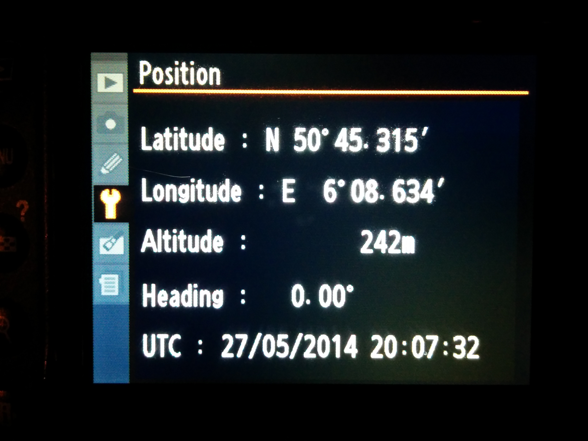
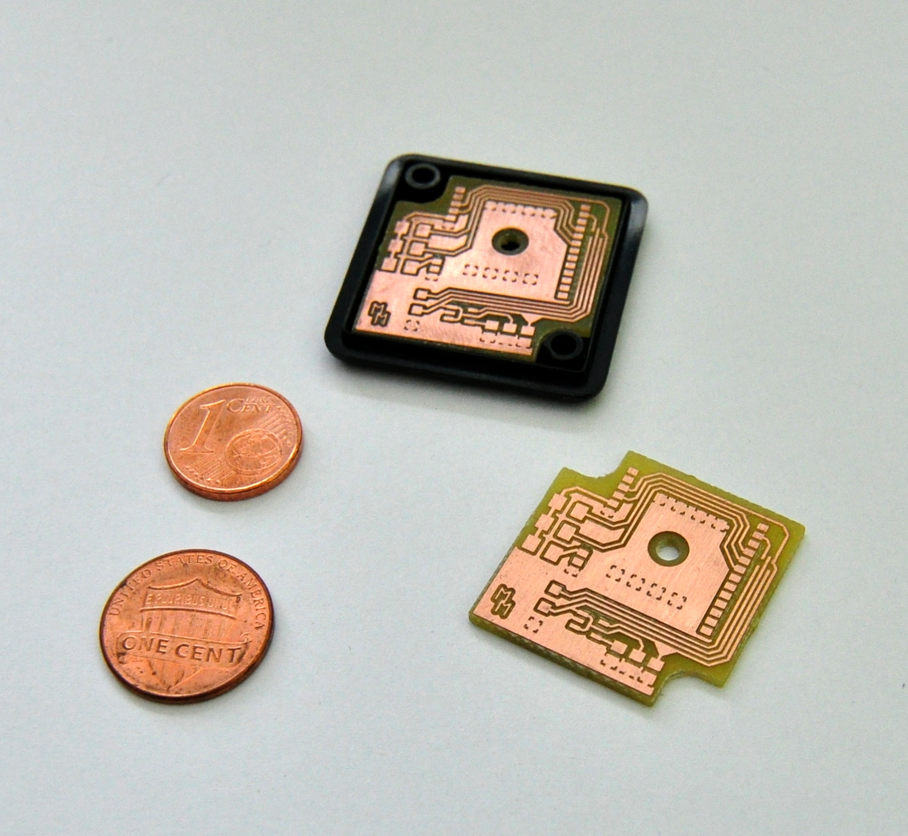

Building Log
============

(sorted most recent first)

## 5/27/14 - Assembling the Device

Soldering of the parts was easier than expected, even the small MAX3370 could be
soldered without too many issues. Before connecting the board to the camera, an
electrical check has been performed first (to make sure no pads are erroneously
shorted) and then a scope has been attached to the data output to make sure the
GPS module is operating normally. The device was powered by an external power
supply with 5.5V output. While only an analog scope was available, it was
sufficient to see the NMEA data bursts coming in with a regular interval (image
links to youtube):

The board was then placed inside the case and connected to the camera. It works!

After waiting for about 30 - 60 seconds for the first GPS fix, the camera is
able to show the location and photographs are automatically tagged with said
location. The last step to complete the project is to connect the case with a
hot shoe cap such that the module can be attached securely to the camera body.

## 5/27/14 - Milling the PCB

During an appointment at my local [FabLab](https://hci.rwth-aachen.de/fablab), I
could use a mill to create a prototype of the PCB. In contrast to
photoengraving, milling a small board is much faster and cleaner because no
chemicals have to be used for etching the copper. Milling the 28.5mm x 28.5mm
board took about 10-15 minutes:

With the PCB being the last missing component, we can now assemble the device,
check if it operates normally when supplying current and finally try to connect
it to the camera. Soldering the MAX3370 level shifter will probably be the most
complicated part as it comes in a very small package (0.65mm pin distance).

## 5/20/14 - Received the parts

While the PCB is not done yet, I could do first experiments with the Hammond
case. Due to the limited space, I will change the PCB layout a bit and mount the
PCB upside down (i.e. the PCB will be attached to the lid). Advantages:

- No problem with missing height anymore (with regular mounting ~0.7mm are
  missing)
- Case screws will be on the bottom, thus practically invisible
- No need for screw holes on PCB itself, making much more space available for
  routing

Unfortunately, the PCB has to trimmed by about a millimeter on each side. This
should not cause any problems with the current layout, though. The cable will
stick out to the side. Using the original cable protection from the remote
trigger, we have a very clean looking connection:

